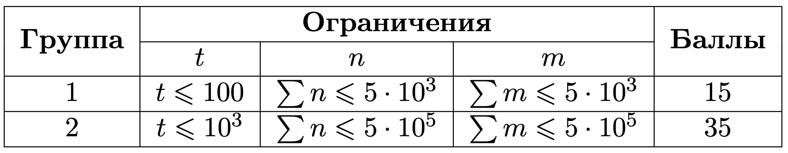

# 4.Планировщик заказов

## Ограничения по времени и памяти Go

**Время** 3,000 мс

**Память** 256 мб

## Условие задачи

Имеется $n$ заказов. Все $\\textbf{заказы идентичны}$ и занимают одинаковое пространство. Известно что $i$-й заказ прибудет в пункт сортировки ровно в момент времени $arrival[i]$. Все $arrival[i]$ $\\textbf{различны}.$ Также есть $m$ грузовых машин. У каждой машины $j$ есть время начала погрузки товаров $start[j]$, время выезда с порта погрузки $end[j]$ и количество вмещаемых заказов $capacity[j].$ 

Определите для каждого заказа $i$, в какую грузовую машину он попадёт.

Заказ попадает в машину, которая находится в пункте сортировки в момент прибытия заказа.

Если в один и тот же момент времени в пункте сортировки находится несколько машин, то заказ попадает в ту машину которая приехала раньше: $start[j]$ минимальный. Если же минимальный $start$ совпадает у нескольких машин то выбирается та, у которой индекс $j$ минимальный. 

При этом в машине не может быть больше, чем $capacity[j]$ заказов. Следовательно, если машина загружена — заказ попадает в следующую машину, удовлетворяющую условиям выше.

## Входные данные

Каждый тест состоит из нескольких наборов входных данных.

Первая строка содержит целое число $t$ $(1 \\le t \\le 10^3)$ — количество наборов входных данных.

Далее следует описание наборов входных данных.

Первая строка содержит целое число $n$ $(1 \\le n \\le 5\\cdot 10^5)$ — количество заказов.

Вторая строка каждого набора входных данных содержит $n$ целых чисел $arrival_i$ $(1 \\le arrival_i \\le 10^9)$, разделенных пробелом — массив $arrival$.

Третья строка содержит целое число $m$ $(1 \\le m \\le 5\\cdot 10^5)$ — количество грузовых машин.

Далее следует m строк, каждая из которых содержит три целых числа $start[j]$, $end[j]$, $capacity[j]$ $(1 \\le start[j] \\le end[j] \\le 1e9$, $1 \\le capacity[j] \\le n)$ — время погрузки товаров, время выезда с порта погрузки и количество вмещаемых заказов для $j$ $(1 \\le j \\le m)$ машины.

Гарантируется, что сумма значений $n$ и $m$ по всем наборам входных данных не превышает $5\\cdot 10^5$.



## Выходные данные

Для каждого набора входных данных выведите одну строку.

Строка должна содержать ответ на задачу — для каждого заказа $i$ это номер машины, которая будет перевозить заказ.

Выведите $-1$, если:
$\\bullet$ время прибытия заказа в пункт сортировки не попадает ни в один из временных интервалов, когда идёт загрузка в машины;
$\\bullet$ во время доставки заказа в пункт сортировки все машины полностью загружены.

## Набор тестов

[Скачать](./order-planner.zip)

## Пример теста 1

### Входные данные

```
3
5
1 9 2 6 4
3
1 8 3
3 10 1
4 7 4
5
1 9 2 6 4
3
1 8 3
3 10 2
4 7 4
8
100 37 19 2 46 4 15 88
4
27 80 1
1 46 2
41 83 1
1 75 2
```

### Выходные данные

```
1 -1 1 2 1 
1 2 1 2 1 
-1 1 4 2 3 2 4 -1 
```